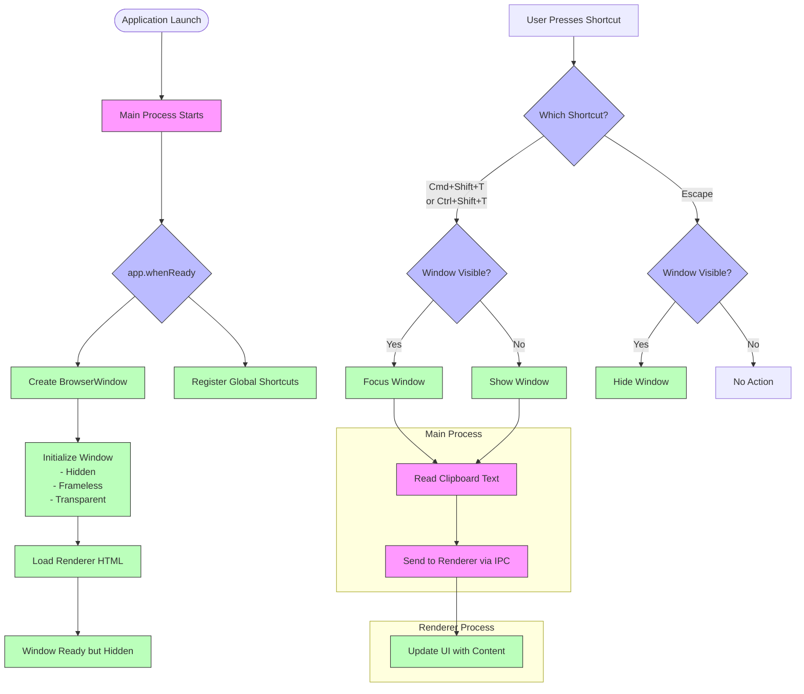

# Clipboard Viewer Documentation

## Table of Contents
- [Overview](#overview)
- [Architecture](#architecture)
- [Setup and Installation](#setup-and-installation)
- [Features](#features)
- [Technical Implementation](#technical-implementation)
- [Development Guide](#development-guide)
- [Troubleshooting](#troubleshooting)

## Overview

Clipboard Viewer is a sleek, minimal desktop application inspired by Raycast that provides quick access to clipboard contents through global keyboard shortcuts. Built with Electron and TypeScript, it offers a non-intrusive, elegant way to view and interact with copied text.

## Architecture

The application follows the standard Electron architecture with main and renderer processes, using IPC (Inter-Process Communication) for data transfer between processes.

### Application Flow Diagram



### Key Components

1. **Main Process (`src/main/index.ts`)**
   - Entry point for the application
   - Manages window creation and lifecycle
   - Coordinates global shortcuts

2. **Shortcuts Module (`src/main/shortcuts.ts`)**
   - Registers global keyboard shortcuts
   - Handles clipboard reading
   - Sends clipboard data to renderer via IPC

3. **Preload Script (`src/preload/final.ts`)**
   - Securely exposes Electron APIs to the renderer
   - Provides IPC communication bridge

4. **Renderer Process (`src/renderer/final.html`)**
   - Displays the UI
   - Receives and displays clipboard data

## Setup and Installation

### Prerequisites
- Node.js (v14 or later)
- pnpm (preferred package manager)

### Installation Steps

1. Clone the repository:
   ```bash
   git clone https://github.com/yourusername/clipboard-viewer.git
   cd clipboard-viewer
   ```

2. Install dependencies:
   ```bash
   pnpm install
   ```

3. Development mode:
   ```bash
   pnpm run dev
   ```

4. Build for distribution:
   ```bash
   pnpm run dist
   ```

## Features

### Core Functionality
- **Global Shortcuts**
  - `Cmd+Shift+T` (macOS) or `Ctrl+Shift+T` (Windows/Linux): Toggle clipboard viewer
  - `Escape`: Hide window

- **Clipboard Viewing**
  - Real-time display of clipboard text content
  - Automatic updates when new content is copied

- **UI Characteristics**
  - Frameless, transparent window
  - Minimal dark interface inspired by Raycast
  - System tray icon for easy access

## Technical Implementation

### Application Startup Process

1. **Application Launch**
   - Electron main process initializes

2. **Window Creation**
   - BrowserWindow is created with specific properties:
     - Frameless
     - Transparent background
     - Initially hidden
     - Correct size and position

3. **Shortcut Registration**
   - Global shortcuts are registered at the system level
   - Shortcut handlers are configured

4. **Event Handling Setup**
   - IPC channels are established
   - Window events (focus, blur, etc.) are configured

### Keyboard Command Handling

#### Cmd+Shift+T / Ctrl+Shift+T
1. Shortcut is detected by the main process
2. If window is visible, it gains focus
3. If window is hidden, it becomes visible and gains focus
4. Current clipboard content is read
5. Content is sent to renderer via IPC
6. Renderer displays the content

#### Escape Key
1. Shortcut is detected by the main process
2. If window is visible, it's hidden
3. Application continues running in the background

### Data Flow
- Clipboard access happens in the main process for security
- IPC channels securely transfer data between processes
- Renderer receives updates and displays content

## Development Guide

### Project Structure
```
clipboard-viewer/
├── src/
│   ├── main/           # Main process code
│   │   ├── index.ts    # Entry point
│   │   ├── shortcuts.ts # Keyboard shortcuts
│   │   └── create-icon.ts # Tray icon creation
│   ├── preload/        # Preload scripts
│   │   └── final.ts    # Bridges main and renderer
│   ├── renderer/       # UI files
│   │   └── final.html  # Main UI HTML
│   └── types/          # TypeScript type definitions
│       └── window.d.ts # Window interface extensions
├── dist/               # Build output
├── package.json        # Project metadata and scripts
└── tsconfig.json       # TypeScript configuration
```

### Adding New Features

#### New Shortcuts
1. Add to the `registerShortcuts` function in `src/main/shortcuts.ts`
2. Implement the handler logic
3. Update UI to reflect new shortcut (if applicable)

#### UI Changes
1. Modify `src/renderer/final.html`
2. Test appearance in both dark and light modes
3. Ensure proper scaling on different screen sizes

#### Additional Clipboard Formats
1. Update the clipboard reading logic in `src/main/shortcuts.ts`
2. Extend the IPC messaging system
3. Enhance renderer to display new formats

## Troubleshooting

### Common Issues

#### Shortcuts Not Working
- Ensure no other application is using the same shortcuts
- Check application permissions (especially on macOS)
- Verify the application is running in the background

#### Window Not Appearing
- Check if the window is positioned off-screen
- Restart the application
- Verify there are no errors in the console

#### Clipboard Content Not Updating
- Check if the application has proper clipboard access permissions
- Ensure the IPC channel is working correctly
- Verify the clipboard format is supported (text only in current version)

### Debug Mode
Run the application with debug logging:
```bash
NODE_ENV=development DEBUG=clipboard-viewer:* pnpm run dev
```
